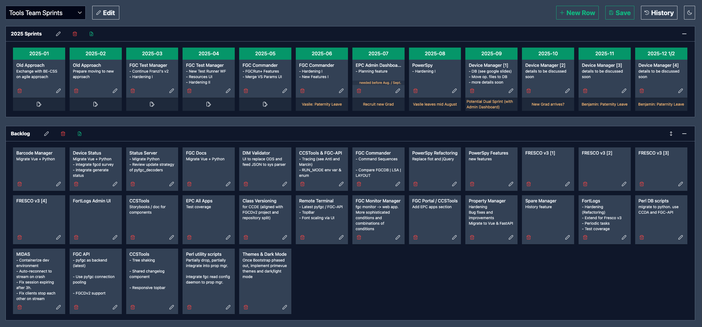

# 🗓️ Timeline Planner

A full-stack web application for planning, discussing, and managing timelines.

Built with **Vue 3**, **Vite**, **Express**, and **TypeScript**.

For example for planning and discussing with management about which products / sprints you will work on in the coming months.

## 🚀 Features:
- Create new boards for different timelines / contexts
- Create rows / lanes on a board
- Create cards and move them between lanes
- Reorder cards on a lane
- Optionally use fixed columns on lanes (showing header titles and comment sections per column)
- Save, edit, or delete boards, lanes, and cards.

## 📦 Persistence:
- The server currently persists boards as `.json` files on the backend.

## 🖼️ UI Example


---

## 📦 Prerequisites

- [Node.js](https://nodejs.org/) (v18+)
- [pnpm](https://pnpm.io/) (v8+)

---

## 🚀 Development

Start both the client and server in parallel:

```bash
pnpm dev
```

This runs:

- `client/` via Vite dev server (port `5173`)
- `server/` via `tsx` (port `4000`)

> Make sure you have a `.env` file at the project root. See `.env.example` for reference.

---

## 🏗️ Build

To type-check and build both the client and server:

```bash
pnpm build
```

Individual commands:

```bash
pnpm build:client       # Build Vite app to client/dist
pnpm type-check         # Run type-checking on client and server
pnpm type-check:client  # Run type-checking on client only
pnpm type-check:server  # Run type-checking on server only
```

---

## 🧪 Linting

Lint the code:

```bash
pnpm lint
```

Auto-fix linting issues:

```bash
pnpm lint-fix
```

---

## 📁 Project Structure

```
.
├── client/           # Frontend (Vue 3 + Vite + Tailwind)
├── server/           # Backend (Express + TypeScript)
├── shared/           # Shared utilities and types for both, client and server
├── .env              # Environment config for local dev (project root)
└── package.json
```

---

## 📜 License

This project is open source and released under the [MIT License](https://opensource.org/licenses/MIT).